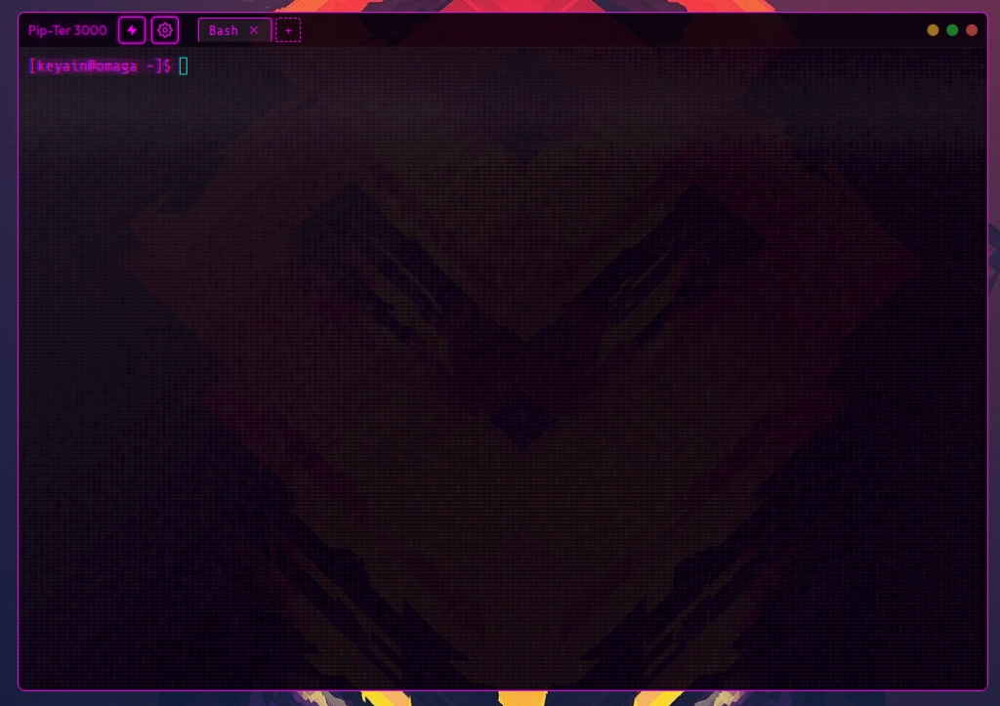
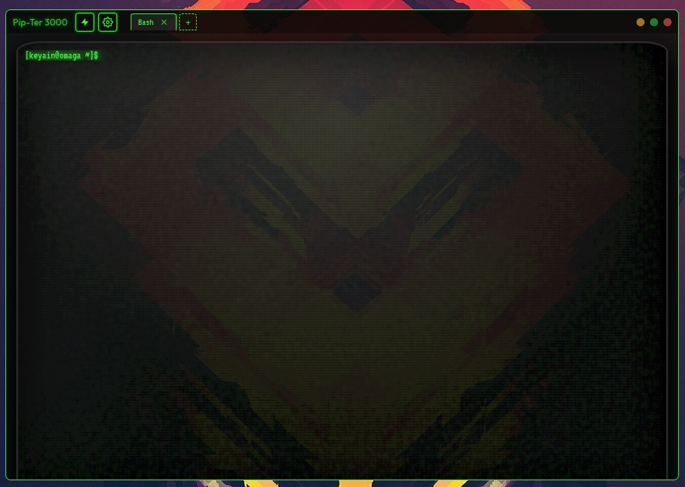
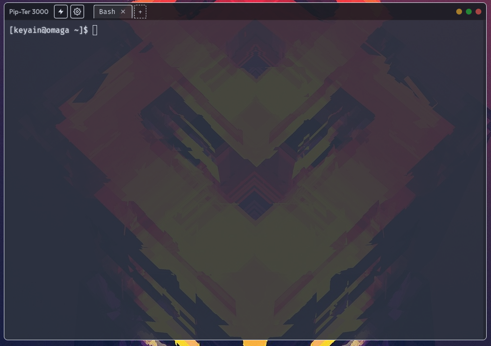
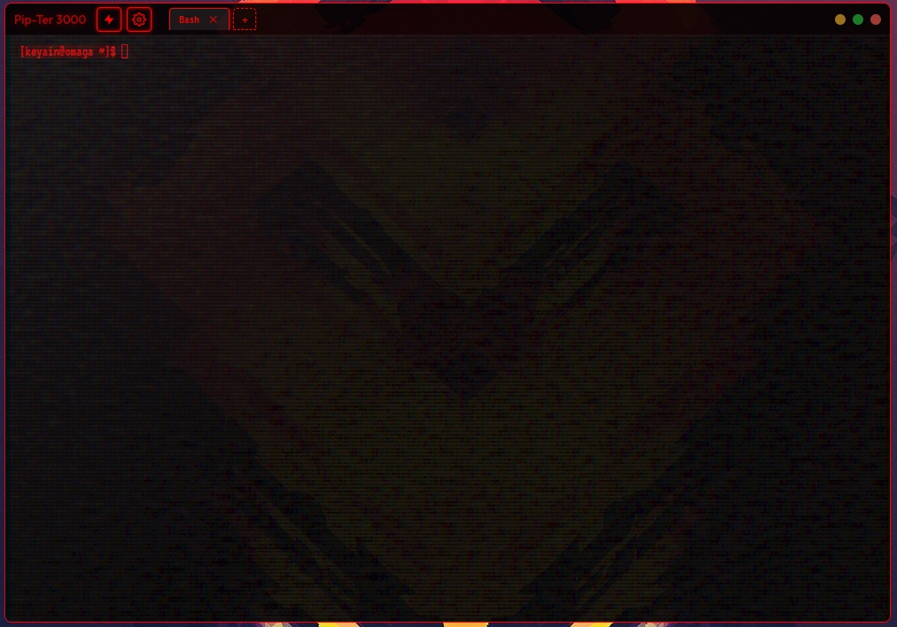

# Pip-Ter 3000

[](https://buymeacoffee.com/keyain)

<p align="center">
  
  
</p>
<p align="center">
  
  
</p>

A highly-customizable, retro-futuristic cyberpunk desktop terminal emulator built on React, xterm.js, and Electron. It brings back the classic CRT monitor aesthetics (phosphor glow, curvature distortion, scanlines, flicker, and mechanical keyboard sounds) while providing modern features like SSH profiles, real-time command/error syntax highlighting, and hardware-accelerated layouts.

---

## Features 🚀

- **Retro CRT Screen Simulator**: Full control over retro display parameters including:
  - Phosphor bloom & glow intensity
  - Curvature tube bending distortion (CRT warp)
  - Horizontal scanline scroll & strength
  - Screen phosphor flicker
  - Static grain noise
  - Jitter/shake effect simulating hardware voltage spikes
- **Built-in Sound Synthesizer**: Procedural keystroke sound FX generated dynamically using the Web Audio API (profiles: *Typewriter*, *Mechanical*, *Cyber Beep*).
- **Session & SSH Connection Manager**: Save local terminal configurations or remote SSH credentials grouped into folders with collapsing navigation.
- **Shell Auto-Detection**: Electron scans `/etc/shells` on launch to present auto-complete suggestions inside a `<datalist>` dropdown when adding new local connections.
- **Dynamic CSS Theme Engine**: Seamlessly switch between themes (*Amber Fallout, Nord, Dracula, Cyberpunk Overload, Gameboy LCD, Red Alert, Synthwave*) or create custom themes using detailed color pickers.
- **Smart Stream Highlighter**: Real-time coloring of standard keywords (errors/exceptions highlighted in red, commands in green) directly inside the PTY stream.
- **Clipboard Integration**: Support for native terminal clipboard shortcuts (`Ctrl+Shift+C` to copy selections, `Ctrl+Shift+V` to paste text).
- **System Bell Sound Beep**: Triggers a synthesized vintage terminal beep (800Hz decaying wave via Web Audio API) whenever the console receives a Bell code (`\x07`).
- **Tab Layout & Key Shortcuts**: Support for keyboard navigation shortcuts:
  - `Ctrl+Shift+T`: Open a new terminal tab (Bash)
  - `Ctrl+Shift+W`: Close the active tab
  - `Ctrl+Tab` / `Ctrl+Shift+Tab`: Cycle through tabs forward/back
- **Inline Tab Renaming**: Double-click any tab header to rename it dynamically via an inline styled text input.
- **Glassmorphic Transparency**: Fully adjustable background transparency and backdrop blur (`backdrop-filter`) blending beautifully with your Linux window compositor.
- **Custom Background Media**: Support for adding static image backdrops or looping `.mp4`/`.webm` background videos behind the console layout.

---

## Installation & Running 🛠️

### Prerequisites
Make sure you have [Node.js](https://nodejs.org/) installed on your Linux system.

### Steps
1. Clone the repository:
   ```bash
   git clone https://github.com/Keyain-Zasky/Pip-Ter-3000.git
   cd Pip-Ter-3000
   ```
2. Install the dependencies:
   ```bash
   npm install
   ```
3. Compile and build the React bundles:
   ```bash
   npm run build
   ```
4. Start the application (runs Vite hot-reload and Electron concurrently):
   ```bash
   npm start
   ```

### Desktop Integration & Default Terminal (KDE Plasma) 🖥️

You can easily register Pip-Ter 3000 to launch as a native application and set it as your default terminal emulator:

1. **Register the Desktop Launcher**:
   Run the registration script (it compiles the production assets, installs the `.desktop` file to `~/.local/share/applications/`, and updates your desktop database):
   ```bash
   ./register-desktop.sh
   ```
2. **Set as Default Terminal**:
   - Open your system menu and search for **System Settings**.
   - Navigate to **Applications** -> **Default Applications**.
   - Under **Terminal Emulator**, choose **Pip-Ter 3000**.
   - To configure keyboard shortcuts, go to **Shortcuts** inside System Settings, add a shortcut command mapping, and bind it to your preferred keys (e.g. `Shift+Meta+T`).

---

## Known Issues ⚠️

### 1. Transparent Frameless Window Resizing on Wayland (Linux)
- **Symptom**: Resizing the window leaves black bands or areas on the screen, and the viewport fails to stretch/contract to the new window size.
- **Cause**: Chromium has an upstream limitation handling hardware-accelerated transparent windows on native Wayland compositors (such as GNOME or KDE Plasma).
- **Workaround**: We enforce the Ozone platform to X11 (`--ozone-platform=x11` inside `main.js`), which directs Electron to run under **XWayland**. This ensures stable transparency composition and layout reflow during window resizing.

### 2. GPU Driver Resizing Lag & Flickering
- **Symptom**: Heavy tearing, lag, or visual trails during resizing on certain compositors (e.g. KWin or Mutter).
- **Workaround**: If you encounter issues, try running the application in software rendering mode to verify:
  ```bash
  npm run electron -- --disable-gpu
  ```
  Additionally, native OS window manager shadows have been disabled (`hasShadow: false`) to prevent the compositor from miscalculating the transparent border bounds.

### 3. Font Size Measurement Cache
- **Symptom**: When launching the application for the first time, character spacing or margins might look slightly misaligned.
- **Workaround**: The text container fits the screen automatically. If characters do not fill the borders perfectly, resizing the window slightly will trigger a recalculation event (`safeFit`), aligning the columns and rows instantly.

---

## License 📄
This project is licensed under the MIT License - see the LICENSE file for details.
